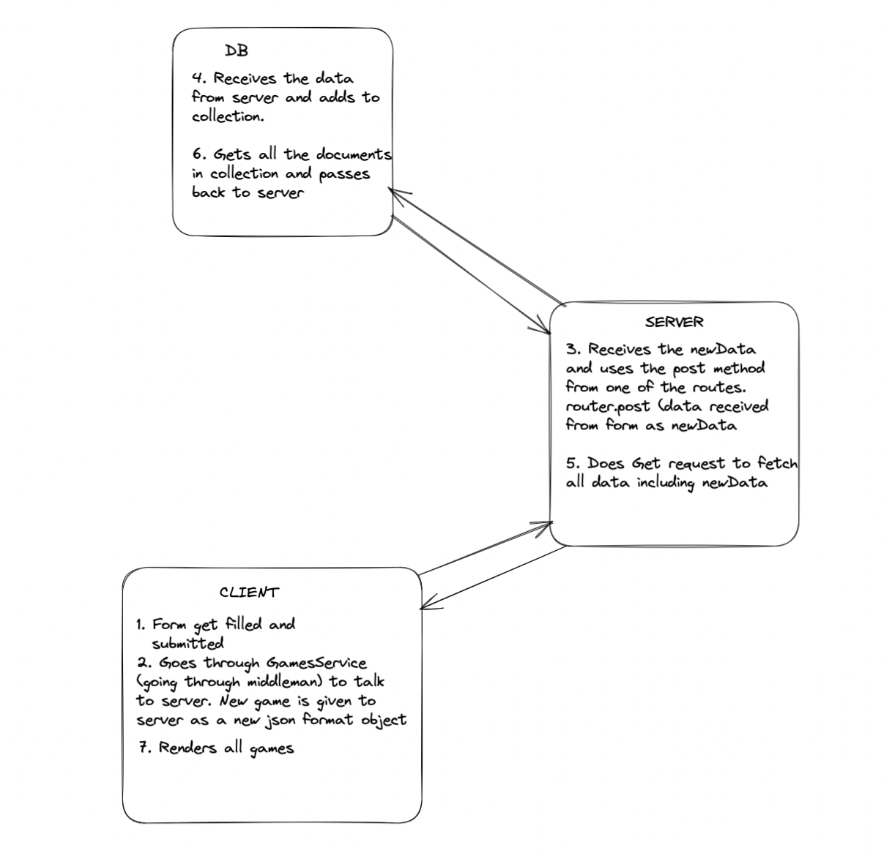

1. What is responsible for defining the routes of the `games` resource? 
    
    The createRouter function
    

2. What do you notice about the folder structure? Whats the client responsible for? Whats the server responsible for?
    a. Server is responsible for the data. With the seed.js file to initially populate the database, create_router.js to define the routes and works together with the server.js file to allow CRUD actions. 
    b. Client is responsible for the frontend. The way it’s going to display everything.

3. What are the the responsibilities of server.js?
    
    To get connection with the mongo database and modularise the routes when they get created.
    
4. What are the responsibilities of the `gamesRouter`?
    
    keeps the route modular, so you won’t need to type /api/games each time.
    

5. What process does the the client (front-end) use to communicate with the server?
    
    the client is able to communicate via a middleman using the GamesService.js file. Which does the fetch requests to the API.
    
6. What optional second argument does the `fetch` method take? And what is it used for in this application? Hint: See [Using Fetch](https://developer.mozilla.org/en-US/docs/Web/API/Fetch_API/Using_Fetch) on the MDN docs
    
    The second argument it takes is an object. In this example it will take in the object from someone attempting to add or remove a game to/from the database and that game will be the object and/or CRUD action. 
    

7. Which of the games API routes does the front-end application consume (i.e. make requests to)? '[http://localhost:9000/api/games/](http://localhost:9000/api/games/)’

8. What are we using the [MongoDB Driver](http://mongodb.github.io/node-mongodb-native/) for?
    
    To allow connection from our application to the mongo database and allow our app to work with the data and allow CRUD operations to the database

Diagram:
